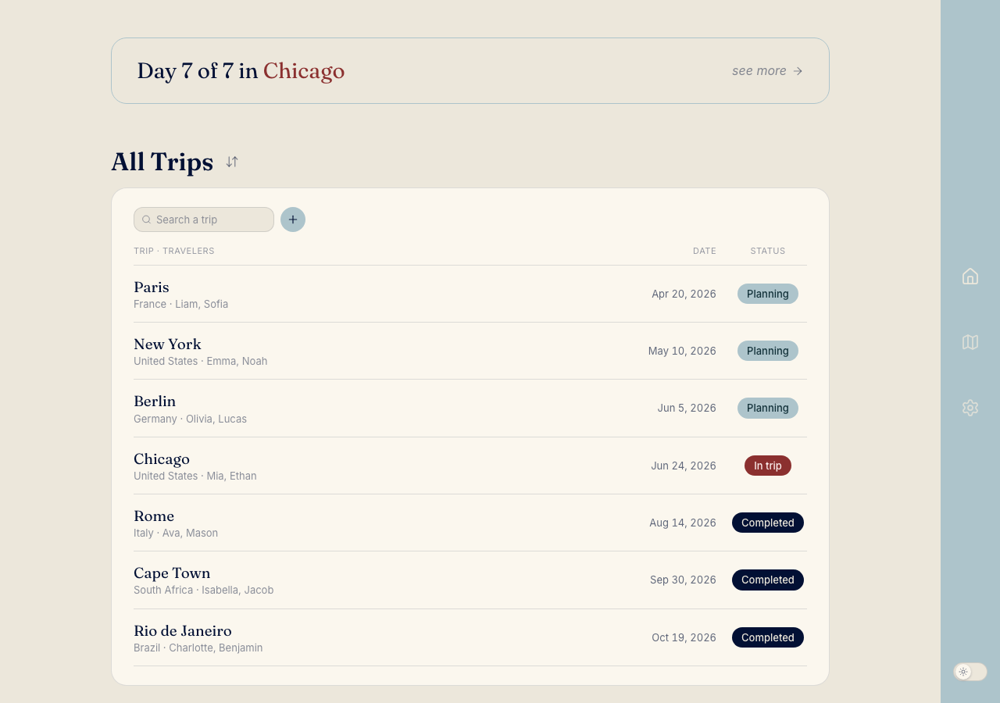

# Travel Planner

A calm, editorial trip planner for organizing multi-city journeys — day by day, place by place. Everything is saved in your browser, so it works offline and needs no account.

**▶ Live app: [amberc0812.github.io/travel-planner](https://amberc0812.github.io/travel-planner/)**



## Features

- **Trips → Cities → Days → Places** — build an itinerary as a clean hierarchy. Add cities, then days within each city, then places within each day.
- **Rich place details** — attach transportation (flight/train/car/walk…), costs, documents (PDF/JPG), notes, and a time to any place.
- **Drag & drop** — reorder days, places, and details, and drag a detail into any destination.
- **Interactive map** — a 2D/3D globe of everywhere you've been and planned, colored by year and status.
- **Export** — download a trip as a polished PDF or JPG.
- **Collections** — group trips (e.g. "Europe 2026"), reorder them, or auto-sort by date.
- **Make it yours** — pick a main accent color and light/dark/system theme in Settings.

## Tech

React 19 · TypeScript · Vite · Tailwind CSS · dnd-kit · d3-geo · framer-motion. State persists to `localStorage` — no backend required for the core app.

## Run locally

```bash
npm install
npm run dev      # start the dev server
npm run build    # production build
npm run lint     # oxlint
```

## Deployment

- **GitHub Pages** (this live link) — a GitHub Actions workflow (`.github/workflows/deploy.yml`) builds and publishes on every push to `main`. Static hosting, so the optional email-sharing backend below is inactive here.
- **Optional share-by-email backend** — the `/api` folder contains Vercel serverless functions that store a trip and email a shareable link (via Neon Postgres + Resend). To enable it, import this repo into [Vercel](https://vercel.com/new) and set the env vars in `.env.example`. See `DEPLOY.md`.

---

🤖 Built with [Claude Code](https://claude.com/claude-code)
